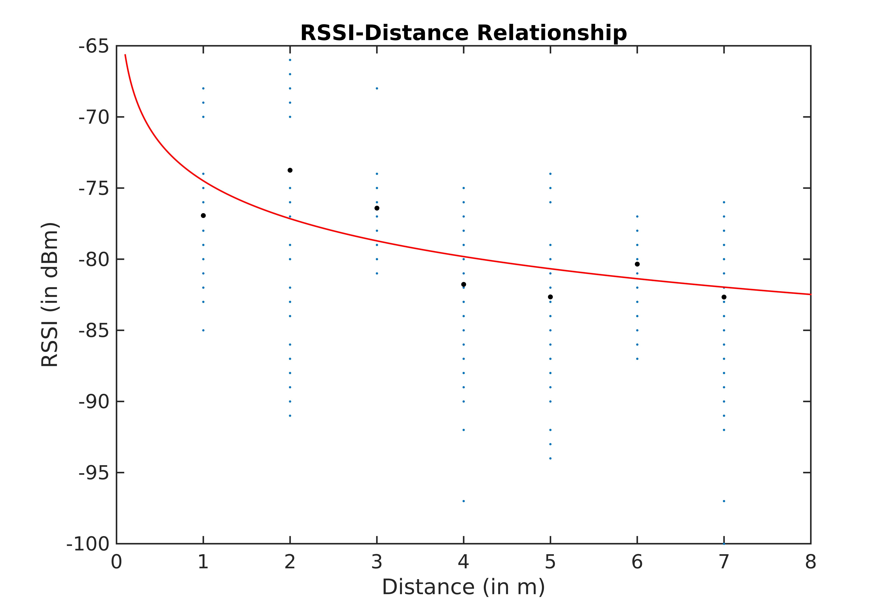
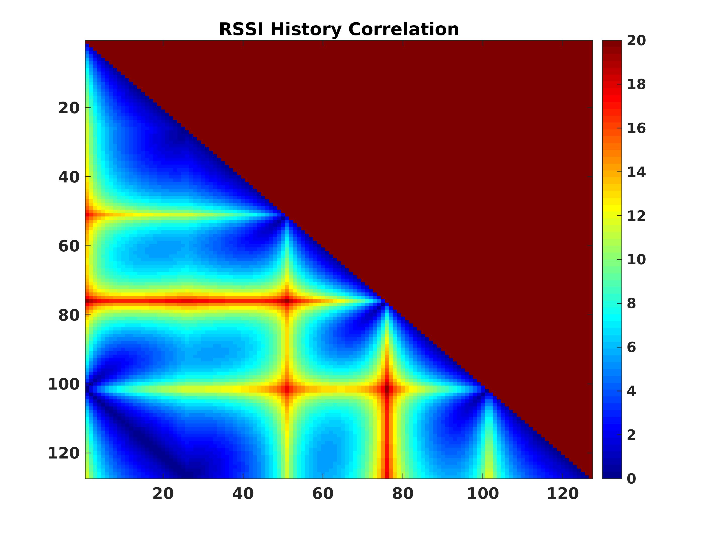
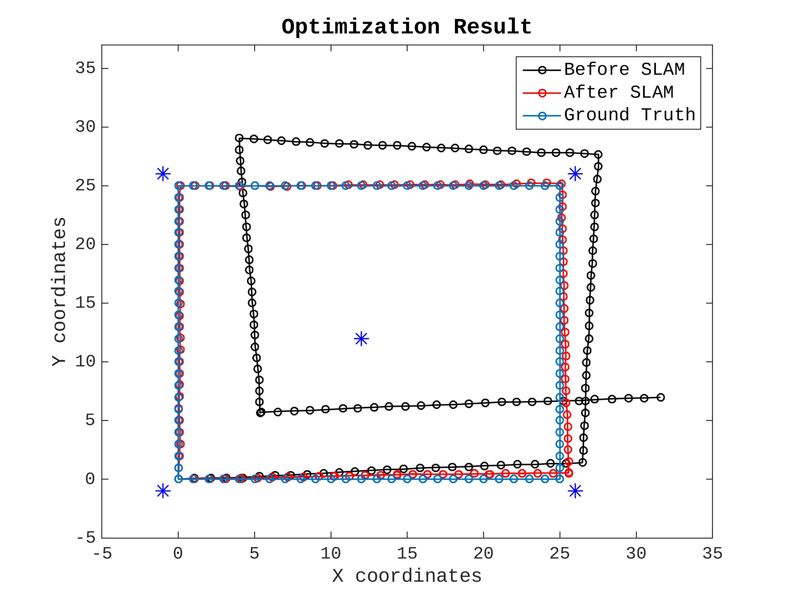
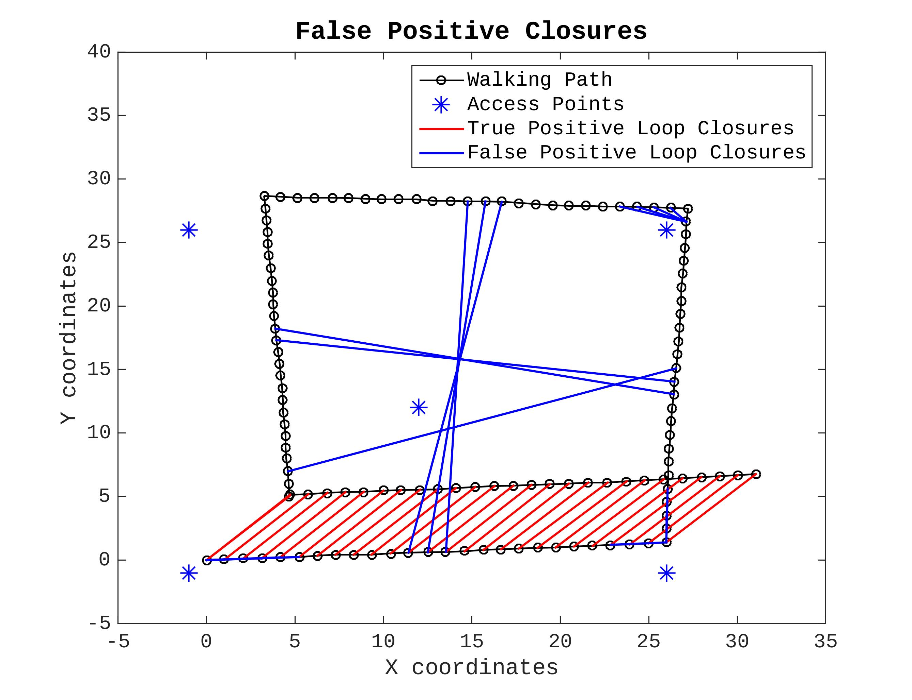
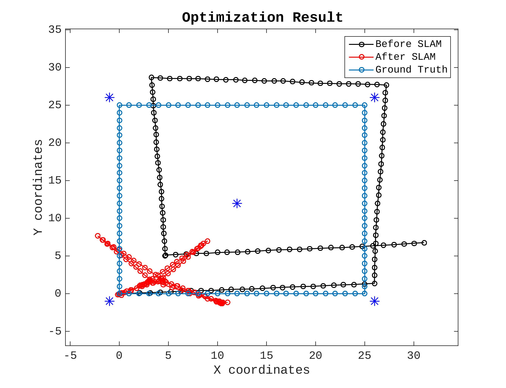

# RSSI-based Graph SLAM Simulation Environment

This repo surves as an initial matlab prototype for Graph SLAM system.

For futher explaination, I refers reader to the research paper [report](https://github.com/ugurbolat/SmartphoneGraphSLAM/blob/master/report/report.pdf), where I also implement a Robust SLAM algorithm with real-world measurement.

## RSSI-Distance Relationship

The measurements are collected from ESP-32 BLE Beacon.

## Ground Truth Trajectory

Artificially created ground truth walking path surrounded by 5 RSSI-based access point.

## Loop Closures with RSSI matches

Low values corresponds to loop closures.

## Measured (Drifted) Trajectory - 1

Artificially created measured walking path for the same ground truth trajectory with loop closures.

## SLAM Optimization Results - 1

This optimization's results are from previous measurements that has only true positive loop closures.

## Measured Trajectory with False Positives - 2

Several false positive loop closures added.

## SLAM Optimization Results - 2

If there are false positive loop closures, the LM method cannot converge to a desired local minimum.

